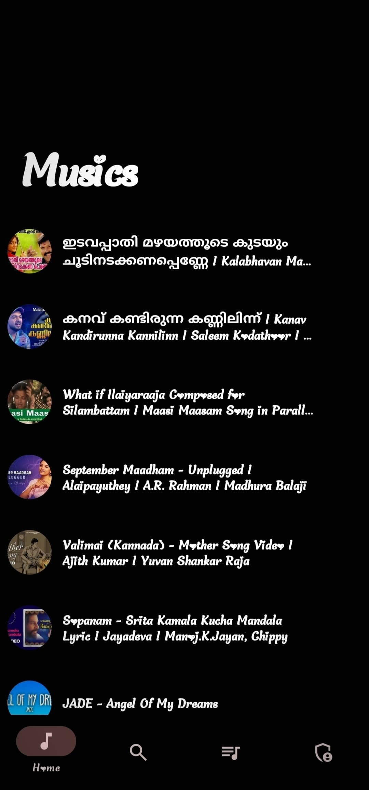
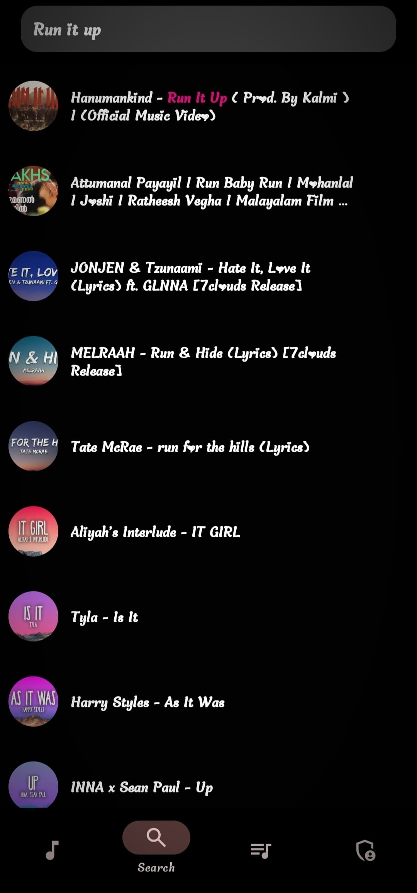
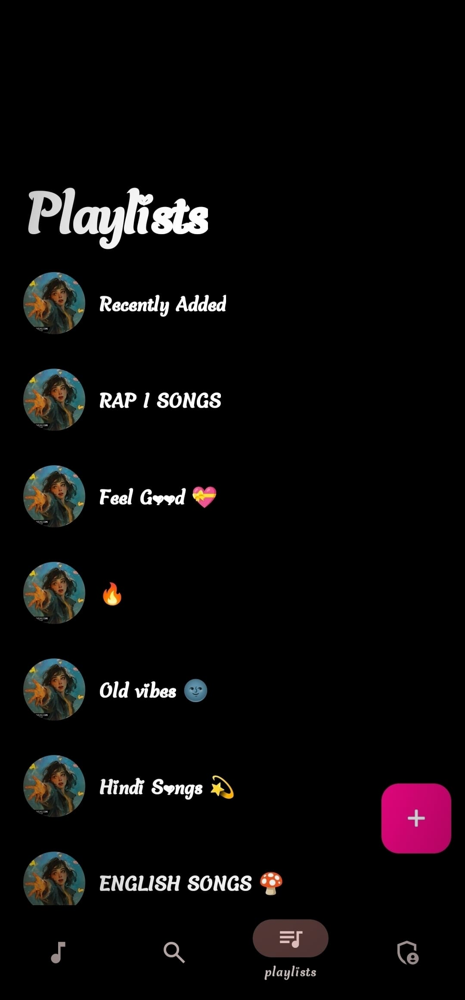
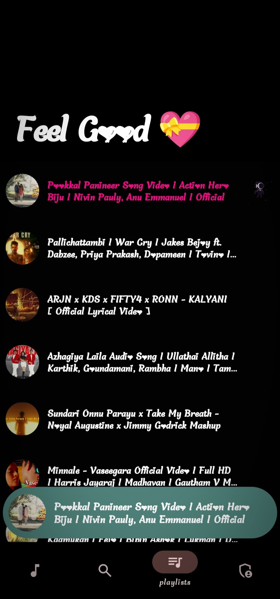
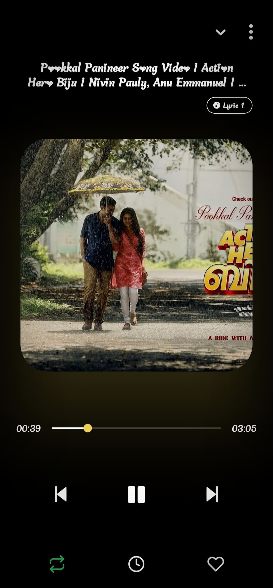

<div align="center">

  # 🎵 vividMusic

  **A modern, high-performance, and beautifully crafted music streaming platform built for mobile.**

  [](https://expo.dev)
  [](https://reactnative.dev)
  [](https://www.typescriptlang.org)
  [](https://nodejs.org)
  [](https://www.mongodb.com)

  <br />

  [Features](#-key-features) • [Screenshots](#-app-showcase) • [Tech Stack](#-tech-stack--architecture) • [Getting Started](#-getting-started) • [Project Structure](#-project-structure)

</div>

---

## 🌟 Overview

**vividMusic** is an elegant, feature-packed mobile music streaming & audio player application. Designed with modern UX principles, it seamlessly combines real-time full-text song discovery, dynamic adaptive interface color palette generation matching album artwork, synced lyrics playback, and smooth background audio controls.

---

## ✨ Key Features

- 🎨 **Adaptive Color Theming**: Automatically extracts vibrant accent palettes from album artwork in real time using `react-native-image-colors` to deliver an immersive visual vibe for every track.
- 🎤 **Synchronized Lyrics**: Enjoy real-time, timed lyric scrolling synchronized down to the second with active track playback.
- ⚡ **Lightning-Fast Search**: High-speed track and artist discovery powered by **MongoDB Atlas Full-Text Search**.
- 🎶 **Background Audio Control**: Built on `expo-audio` and native sound services, ensuring uninterrupted playback across lock screens and background apps.
- 📂 **Smart Playlists & Library**: Create, customize, and curate personal playlists with instant local caching powered by **Zustand** and **MMKV**.
- 🚀 **Silky 60 FPS Scrolling**: Uses `@shopify/flash-list` for ultra-lean memory usage and liquid-smooth scrolling performance across vast song catalogs.
- 🔌 **Real-time Synchronization**: Powered by **Socket.IO** for live state sync and server events.

---

## 📸 App Showcase

<div align="center">

| 🏠 Home Feed | 🔍 Fast Search | 📑 Playlists |
| :---: | :---: | :---: |
|  |  |  |

| 🎵 Playlist Tracks | 🎧 Audio Player | 📜 Synced Lyrics |
| :---: | :---: | :---: |
|  |  |  |

</div>

---

## 🛠 Tech Stack & Architecture

### **Client (Mobile App)**
- **Framework**: Expo (React Native `v0.86`) with `expo-router`
- **Language**: TypeScript (`v6.0`)
- **State Management**: Zustand & `@tanstack/react-query`
- **Audio Engine**: `expo-audio`
- **Animations & UX**: `react-native-reanimated`, `lottie-react-native`
- **UI Performance**: `@shopify/flash-list`, `react-native-image-colors`
- **Local Storage**: `react-native-mmkv` & Async Storage

### **Server (Backend API)**
- **Runtime**: Node.js & Express.js (ES Modules)
- **Database**: MongoDB Atlas (Mongoose ORM) with Full-Text Search Indexing
- **Real-Time Communication**: Socket.IO
- **Media & Metadata Processing**: Cloudinary, Firebase Admin, `music-metadata`, `ytdl-core`, `play-dl`

---

## 🚀 Getting Started

### Prerequisites
- [Node.js](https://nodejs.org/) (v18 or higher recommended)
- [npm](https://www.npmjs.com/) or [yarn](https://yarnpkg.com/)
- [Expo Go](https://expo.dev/client) app installed on your physical device OR an iOS Simulator / Android Emulator.

---

### 📥 Installation & Setup

#### 1. Clone the repository
```bash
git clone https://github.com/AdwaithAnandSR/musicApp.git
cd musicApp
```

#### 2. Setup the Backend Server
```bash
cd server
npm install
```

Configure your environment variables by creating a `.env` file inside `server/`:
```env
PORT=5000
MONGO_URI=your_mongodb_atlas_connection_string
CLOUDINARY_URL=your_cloudinary_url
```

Start the development server:
```bash
npm run dev
```

#### 3. Setup the Mobile Client
Open a new terminal tab and navigate to `client/`:
```bash
cd client
npm install
```

Start the Expo development server:
```bash
npm start
```
> Scan the QR code displayed in your terminal using the **Expo Go** app (Android) or Camera app (iOS) to launch vividMusic on your device.

---

## 📁 Project Structure

```text
musicApp/
├── client/                 # React Native / Expo Mobile App
│   ├── src/
│   │   ├── app/            # File-based routing (Expo Router)
│   │   ├── components/     # Reusable UI Components & Player controls
│   │   ├── hooks/          # Custom React Query & Audio Hooks
│   │   ├── store/          # Zustand State Stores (Player, Playlist, Theme)
│   │   └── utils/          # Helper functions & Color extractors
│   ├── assets/             # Fonts, icons, static assets
│   └── package.json
│
├── server/                 # Express Backend API
│   ├── config/             # DB & Cloud Service configurations
│   ├── handlers/           # Request controllers
│   ├── models/             # Mongoose schemas (Song, Playlist, User)
│   ├── routes/             # REST API endpoints
│   └── index.js            # Server entry point & Socket.IO initialization
│
├── images/                 # App Screenshots & Showcase assets
└── README.md
```

---

## 🤝 Contributing

Contributions, issues, and feature requests are welcome!  
Feel free to check the [issues page](https://github.com/AdwaithAnandSR/musicApp/issues) if you want to contribute or report a bug.

---

<div align="center">
  Crafted with ❤️ for music lovers.
</div>

